<p align="center">
  <picture>
    <source media="(prefers-color-scheme: dark)" srcset="docs/imagens/logo-adversia-branca.png">
    
  </picture>
</p>

<h3 align="center">A divorciar? AdversIA</h3>

<p align="center">
  <strong>Veja a sua tese pelos olhos da parte contrária.</strong><br>
  Revisão adversarial de estratégias em Direito de Família, com inteligência artificial.
</p>

<p align="center">
  <a href="https://adversia.vercel.app"><strong>Acesse o site: adversia.vercel.app</strong></a><br>
  <sub>Demonstração gratuita, sem cadastro</sub>
</p>

<p align="center">
  Hackathon da Cidadania OAB/PR 2026 · Trilha Inovação Aberta e Cidadania
</p>

<p align="center">
  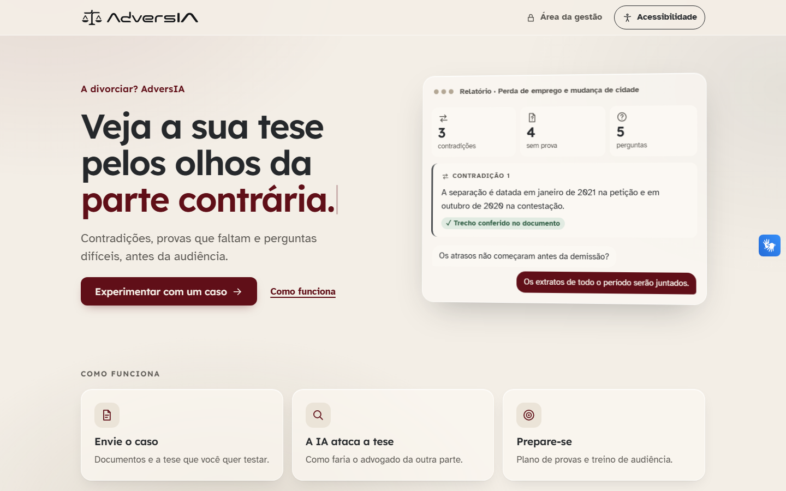
</p>

---

## Sumário

- [O que é](#o-que-é)
- [O problema](#o-problema)
- [A solução](#a-solução)
- [Como funciona](#como-funciona)
- [O sistema em imagens](#o-sistema-em-imagens)
- [Por que dá para confiar](#por-que-dá-para-confiar)
- [Acessibilidade](#acessibilidade)
- [Privacidade e cuidados](#privacidade-e-cuidados)
- [Escopo do projeto](#escopo-do-projeto)
- [Casos de exemplo](#casos-de-exemplo)
- [Como é feito](#como-é-feito)
- [Como rodar](#como-rodar)
- [Documentação](#documentação)
- [Integrantes](#integrantes)

---

## O que é

A **AdversIA** é uma assistente para advogados que atuam em **Direito de Família**:
divórcio, partilha de bens, união estável, pensão alimentícia, guarda e convivência,
filiação, curatela e outras situações da Vara de Família.

O advogado envia os documentos do caso e descreve, em poucas linhas, o que pretende
defender. A AdversIA lê tudo **como se fosse o advogado da outra parte** e mostra onde a
estratégia pode ser atacada, **antes** que isso aconteça na audiência.

Ela não decide o caso, não substitui o advogado e não é parecer jurídico. É uma revisão
crítica para o advogado chegar mais preparado.

---

## O problema

Quem constrói uma tese tende a enxergar os pontos fortes e subestimar os fracos. Em
Direito de Família isso pesa ainda mais: as provas costumam ser informais, as versões das
partes divergem e há muita emoção envolvida. Na prática, os problemas aparecem tarde
demais:

- **datas e versões que não batem** entre a petição e a contestação;
- **alegações importantes sem nenhuma prova** que as sustente;
- **perguntas difíceis** do juiz ou da outra parte que ninguém tinha previsto;
- falta de clareza sobre **quais provas ainda precisam ser produzidas**.

Revisar tudo isso manualmente, caso a caso, consome tempo que o advogado muitas vezes não
tem, principalmente o advogado que atende a população com menos recursos.

---

## A solução

Uma ferramenta que faz o papel do "advogado do diabo" em minutos e entrega um relatório
em quatro partes, que também pode ser salvo em PDF:

| | O que entrega |
|---|---|
| **Pontos vulneráveis** | Contradições, alegações sem prova, argumentos que a outra parte pode usar e perguntas difíceis, cada um mostrando de onde veio |
| **Linha do tempo do caso** | Os fatos com data, em ordem, com destaque onde as versões das partes não batem |
| **Plano de provas** | O que providenciar para fechar cada ponto fraco, por prioridade e com a forma lícita de obter |
| **Simulação de audiência** | Um treino em formato de conversa: a parte contrária pergunta, o advogado responde e recebe a avaliação, uma sugestão de como fortalecer a resposta e a réplica |
| **Relatório em PDF** | Documento formal, em linguagem técnica: identificação, tese, síntese, vulnerabilidades numeradas com os trechos dos documentos, cronologia e plano de diligências em tabelas |

E um compromisso que atravessa tudo: **cada trecho citado é conferido, palavra por
palavra, no documento enviado.**

---

## Como funciona

A AdversIA tem **dois jeitos de usar**:

| | Demonstração | Análise com documentos (só gestão) |
|---|---|---|
| Para quem | Qualquer pessoa que queira conhecer o sistema | Equipe de gestão, com código de acesso |
| Custo | **Gratuito**, sem cadastro | Usa a chave da Anthropic da própria pessoa (cerca de US$ 0,25 por análise, cobrado na conta dela) |
| O que acontece | Você escolhe um dos **32 casos fictícios** e vê a análise completa, que foi preparada antes | A inteligência artificial lê os seus documentos na hora |
| Simulação de audiência | **5 perguntas por caso**, cada uma com duas respostas bem construídas para escolher e comparar a avaliação | Você escreve ou fala a sua resposta |

No modo demonstração, o relatório mostra o selo *"Demonstração · análise preparada
previamente"*.

Passo a passo da demonstração:

1. Clique em **Experimentar com um caso**.
2. **Escolha um caso** (dá para filtrar por tipo e ver os documentos antes).
3. Clique em **Analisar caso** e navegue pelas abas do relatório.
4. Na aba **Simular audiência**, treine respondendo às perguntas da parte contrária.
5. Use o botão de impressora para **salvar o relatório em PDF**.

Passo a passo da análise com documentos, liberada só depois de clicar em **Área da
gestão** e digitar o código:

1. **Envie os documentos do caso**: petição, contestação, acordos, declarações (PDF,
   Word ou texto).
2. **Escreva a sua tese**: o que você quer sustentar e em nome de qual parte.
3. **Informe a sua chave da Anthropic.** Ela é usada só naquela análise e não fica
   guardada.
4. **Confirme** que os documentos são fictícios ou anonimizados.
5. **Acompanhe a análise** (seis etapas, de 2 a 3 minutos), leia o relatório, treine na
   simulação de audiência e salve em PDF.

---

## O sistema em imagens

### Casos de exemplo prontos
Filtro por tipo de caso e cartões com um resumo de cada situação, para testar sem
documentos próprios e sem custo.

<p align="center">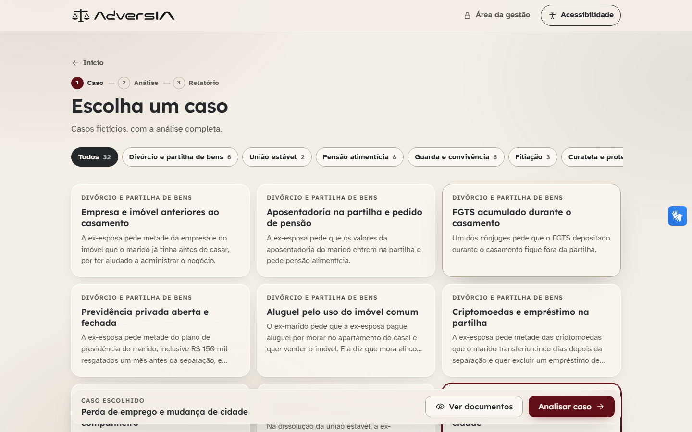</p>

### Análise em etapas
O progresso aparece na tela enquanto o caso é analisado.

<p align="center">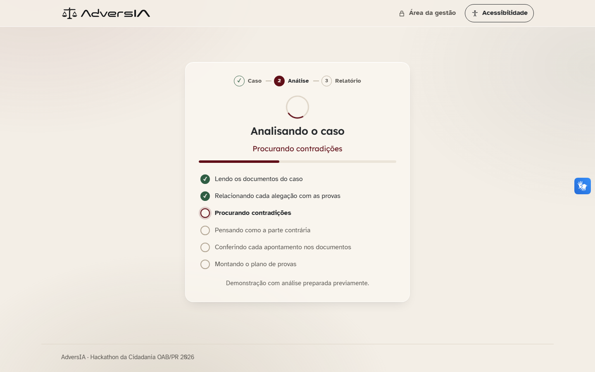</p>

### Pontos vulneráveis
Placar do que a parte contrária pode explorar e cada apontamento com a sua origem e o
trecho conferido no documento. As seções abrem e fecham, para não precisar rolar a página
inteira.

<p align="center">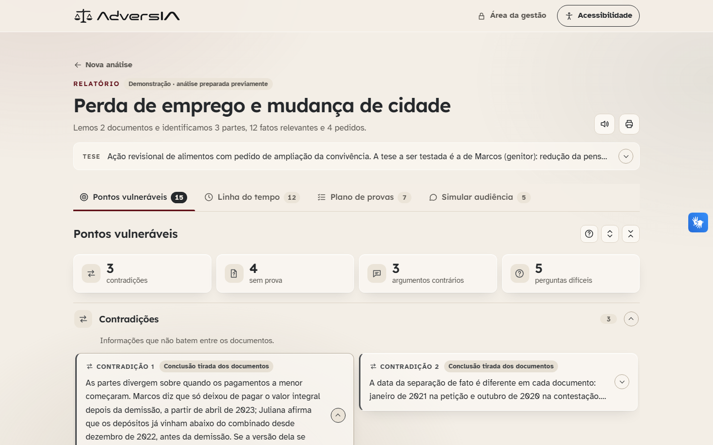</p>

### Linha do tempo do caso
Fatos datados, em ordem, com as divergências entre as versões destacadas.

<p align="center">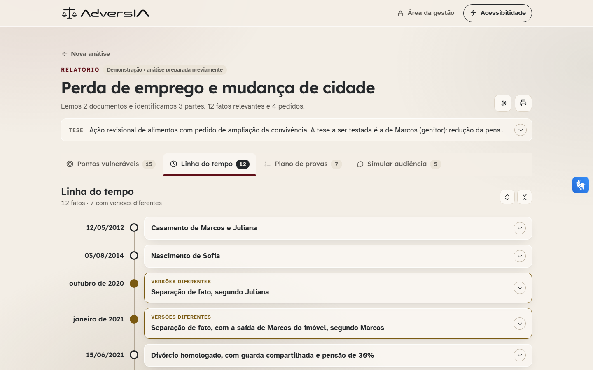</p>

### Plano de provas
O que providenciar, por prioridade, com caixa para marcar o que já foi providenciado e
vínculo direto para o ponto fraco que cada prova resolve.

<p align="center">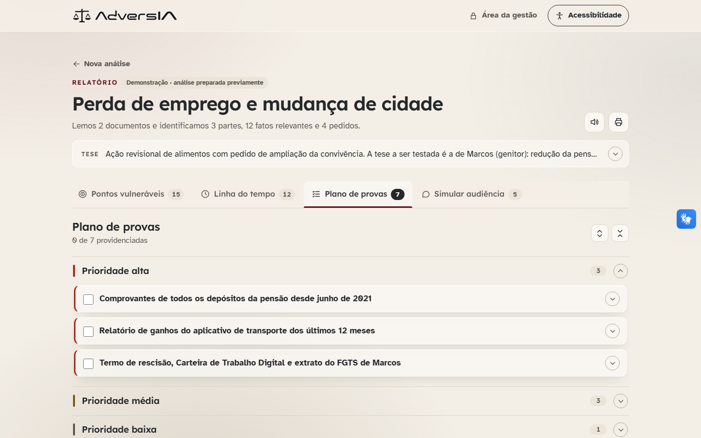</p>

### Simulação de audiência
Em formato de conversa: a parte contrária pergunta, a AdversIA avalia a resposta com base
nos documentos, sugere como fortalecê-la e a parte contrária devolve a réplica.

<p align="center">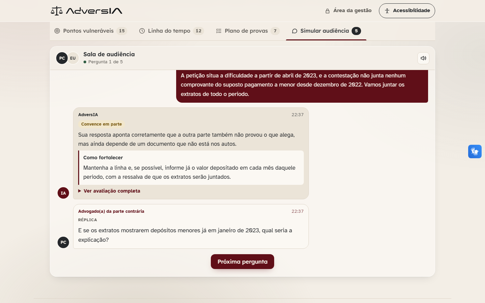</p>

### Relatório em PDF
Documento formal em folha A4, sem os elementos visuais da página, com seções numeradas,
tabelas e numeração de páginas.

<p align="center">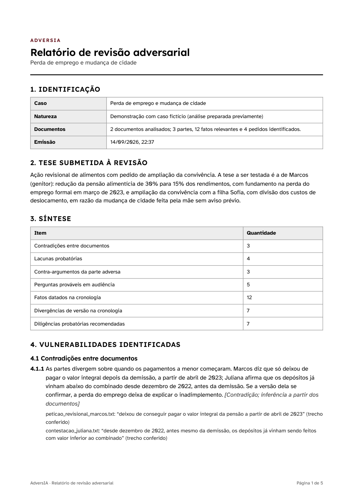</p>

### Acessibilidade, tema escuro e celular

<p align="center">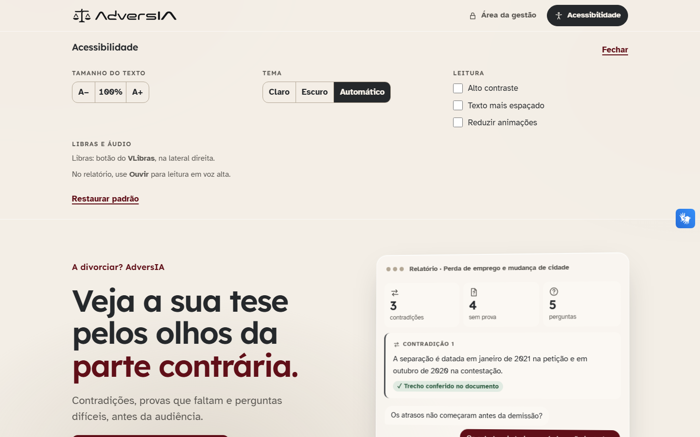</p>

<p align="center">
  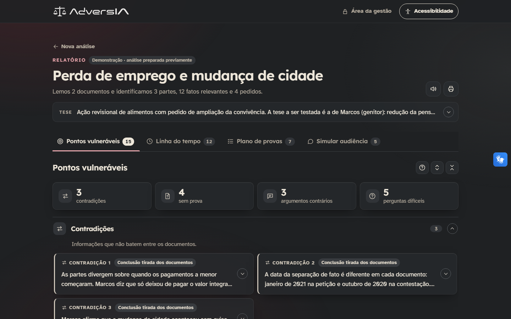
  &nbsp;
  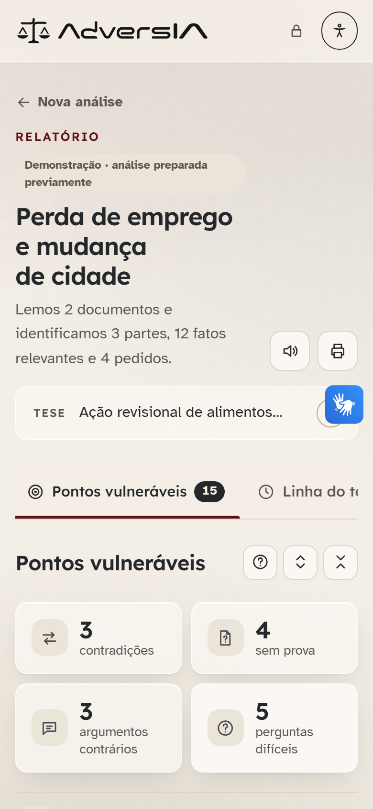
</p>

---

## Por que dá para confiar

- **Tudo mostra de onde veio.** Cada apontamento traz uma etiqueta: *Está nos
  documentos*, *Fonte jurídica citada*, *Conclusão tirada dos documentos*, *Possível
  argumento da outra parte* ou *Sem base suficiente — confira*.
- **Cada trecho citado é conferido automaticamente** no documento enviado:
  *"✓ Trecho conferido no documento"* ou *"Não localizamos este trecho exato — confira"*.
- **Não inventa leis nem decisões.** Nenhum número de lei, artigo ou processo é citado
  sem estar nos documentos.
- **Na dúvida, é cautelosa.** Quando falta base, ela diz isso em vez de afirmar.
- **O advogado sempre decide.** O relatório é apoio à revisão, não parecer jurídico.

---

## Acessibilidade

Pensada para ser usada por todos. No botão **Acessibilidade**, no topo:

- **Libras** pelo **VLibras**, ferramenta oficial e gratuita do Governo Federal;
- **tamanho do texto** de 90% a 175%;
- **tema claro, escuro ou automático**, e **alto contraste**;
- **texto mais espaçado**, que ajuda pessoas com dislexia;
- **reduzir animações** (a página também respeita essa preferência do sistema);
- **ouvir o relatório** e as perguntas em voz alta, e **responder falando** na simulação;
- letras escolhidas pela leitura fácil: Atkinson Hyperlegible, criada para pessoas com
  baixa visão, e Lexend nos títulos;
- uso completo pelo teclado, compatível com leitores de tela, e versão para celular;
- **linguagem simples**, sem termos técnicos.

---

## Privacidade e cuidados

- Versão de demonstração: **use apenas documentos fictícios ou anonimizados**. A tela
  pede essa confirmação antes de cada análise com documentos.
- **Nada é gravado.** Os documentos são lidos, analisados e descartados. Para a simulação
  de audiência, o texto dos documentos fica só na aba do navegador de quem fez a análise.
- **A chave da Anthropic não fica guardada**: vai junto de cada pedido de análise e é
  descartada em seguida. Ela não é salva no navegador nem no servidor.
- **A análise com documentos é só para a gestão**, protegida por código de acesso. O
  público usa apenas os casos fictícios.
- Os casos do modo demonstração são **inventados**. As fontes públicas pesquisadas serviram
  só para escolher os temas; nenhum dado de processo real foi usado.
- Casos de família envolvem dados sensíveis, inclusive de crianças. Para uso com clientes
  reais, seriam necessários login, prazo automático para apagar documentos e contrato com
  o fornecedor da inteligência artificial.
- O relatório é apoio à revisão, **não é parecer jurídico**.

---

## Escopo do projeto

**Dentro do escopo (entregue):**
- Direito de Família: divórcio e partilha, união estável, pensão alimentícia, guarda e
  convivência, filiação, curatela e tomada de decisão apoiada, abandono afetivo (e casos
  relacionados de herança e pensão por morte).
- Leitura de PDF com texto, Word (.docx) e arquivos de texto.
- Relatório de pontos vulneráveis com origem de cada apontamento e conferência dos
  trechos.
- Linha do tempo, plano de provas e simulação de audiência em formato de conversa.
- Exportação do relatório em PDF, em formato de documento técnico.
- Modo demonstração gratuito com 32 casos fictícios, análises preparadas e 5 perguntas de
  audiência por caso.
- Análise real com documentos, restrita à gestão, com a chave da Anthropic da própria
  pessoa.
- Site publicado na internet (Vercel).
- Painel de acessibilidade completo e interface em linguagem simples.

**Fora do escopo desta versão:**
- Outras áreas do Direito.
- Consulta a legislação e jurisprudência externas.
- Leitura de documentos escaneados (só imagem).
- Login, cadastro de escritórios e armazenamento de casos.

**Próximos passos:** login para escritórios, apagamento automático de documentos, leitura
de documentos escaneados, novas áreas do Direito e testes com advogados e com pessoas
usuárias de Libras e de leitores de tela.

---

## Casos de exemplo

Todos os **32 casos** são **fictícios**, sem relação com pessoas reais. De onde vieram os
temas: [catálogo de situações](docs/CATALOGO_DE_SITUACOES.md).

| Tipo | Situações |
|---|---|
| Divórcio e partilha de bens | Empresa e imóvel anteriores ao casamento · Aposentadoria na partilha e pedido de pensão · FGTS acumulado durante o casamento · Previdência privada aberta e fechada · Aluguel pelo uso do imóvel comum · Criptomoedas e empréstimo na partilha |
| União estável | União estável depois da morte do companheiro · Animal de estimação na separação |
| Pensão alimentícia | Perda de emprego e mudança de cidade (**melhor para ver a linha do tempo**) · Filha maior de idade com renda própria · Ex-esposa voltou a trabalhar · Pensão entre ex-cônjuges há muitos anos · Alimentos durante a gravidez · Pensão cobrada dos avós · Pensão atrasada com pedido de prisão · Alimentos compensatórios até a partilha |
| Guarda e convivência | Alegação de alienação parental · Guarda unilateral ou compartilhada · Mudança de residência do filho · Mudança de país com a filha · Guarda com medida protetiva · Convivência dos avós com a neta |
| Filiação | Investigação de paternidade sem exame de DNA · Negatória de paternidade e vínculo afetivo · Pai biológico e pai registral |
| Curatela e proteção | Curatela de mãe com Alzheimer · Tomada de decisão apoiada |
| Herança | Filha que cuidou do pai · Companheira e parentes do falecido |
| Pensão por morte | Relação paralela ao casamento · Pensão combinada em cartório |
| Responsabilidade na família | Indenização por abandono afetivo |

---

## Como é feito

| Parte | Tecnologia |
|---|---|
| Site | HTML, CSS e JavaScript puros, sem framework nem etapa de build |
| Servidor local | Python 3.13, só com a biblioteca padrão (`app/server.py`) |
| Publicação | Vercel: site estático + funções Python em `api/` |
| Inteligência artificial | Claude, da Anthropic, com a chave de quem faz a análise |
| Leitura de documentos | `pypdf` (PDF) e `python-docx` (Word) |

Estrutura do repositório:

```
app/            código Python (pipeline de análise, leitura de documentos, API) e o site em app/static
api/            funções da Vercel: analisar, audiencia e gestao
demo/fontes/    análises e perguntas escritas para os 32 casos de demonstração
golden_dataset/ documentos fictícios de cada caso
scripts/        construir_demo.py: confere cada trecho citado e gera app/static/demo
tests/          testes do pipeline (chamam a API real da Anthropic)
docs/           documentação técnica, decisões, conformidade e imagens
```

---

## Como rodar

**Na internet:** [adversia.vercel.app](https://adversia.vercel.app), publicado na Vercel a
partir deste repositório. O modo demonstração funciona sem nenhuma configuração.

**No computador**, com Python 3.13:

```bash
pip install -r requirements.txt
python -m app.server
# abra http://localhost:8000
```

O modo demonstração funciona sem nenhuma configuração. A análise com documentos é só
para a gestão: defina a variável `ADVERSIA_CODIGO_GESTAO` (no `.env` ou no painel da
Vercel; veja `.env.example`) e informe esse código e a chave da Anthropic na tela. Cada
análise completa custa cerca de US$ 0,25, cobrados na conta de quem informou a chave.

**Depois de alterar um caso de demonstração** (`demo/fontes`), gere os arquivos do site de
novo. O script para se algum trecho citado não estiver, palavra por palavra, no documento:

```bash
python scripts/construir_demo.py
```

**Testes:** `pytest` roda os testes do pipeline com a API real da Anthropic (há custo) e
exige `ANTHROPIC_API_KEY`; sem a chave, eles são pulados.

---

## Documentação

- [Documentação técnica](docs/DOCUMENTACAO_TECNICA.md): arquitetura, módulos, API,
  segurança, testes e limitações.
- [Decisões do projeto](docs/DECISIONS.md): o porquê de cada escolha.
- [Conformidade](docs/CONFORMIDADE.md): acessibilidade, LGPD e segurança.
- [Requisitos de experiência de uso](docs/REQUISITOS_UX.md): as referências que guiaram
  o redesenho da interface.
- [Custos](docs/COSTS.md): quanto custa cada análise e como foi medido.
- [Catálogo de situações](docs/CATALOGO_DE_SITUACOES.md): os 32 casos fictícios e as
  fontes públicas que inspiraram os temas.
- [Testes internos](docs/testes-internos.md) e [roteiro de teste externo](docs/roteiro-teste-externo.md).

---

## Integrantes

- **Giovanna Ribas dos Reis** — [portfólio](https://ribasgiovanna.github.io/)
- **Emelize Bonfim Mlot**
- **Ana Beatriz Patussi**
- **Julia Fernanda Zuchi**
- **Natan Bombini Roth**

---

<p align="center"><sub>AdversIA · Hackathon da Cidadania OAB/PR 2026 · Protótipo de demonstração</sub></p>
